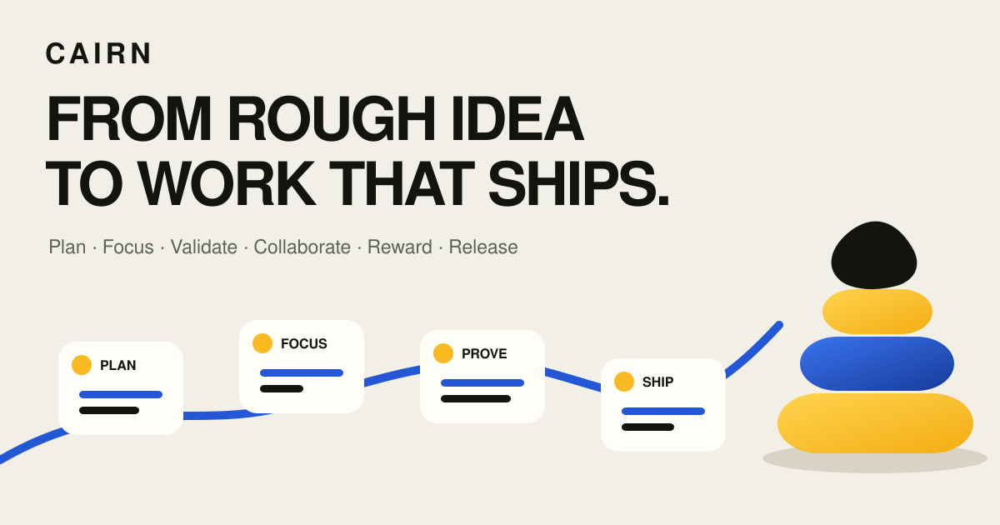
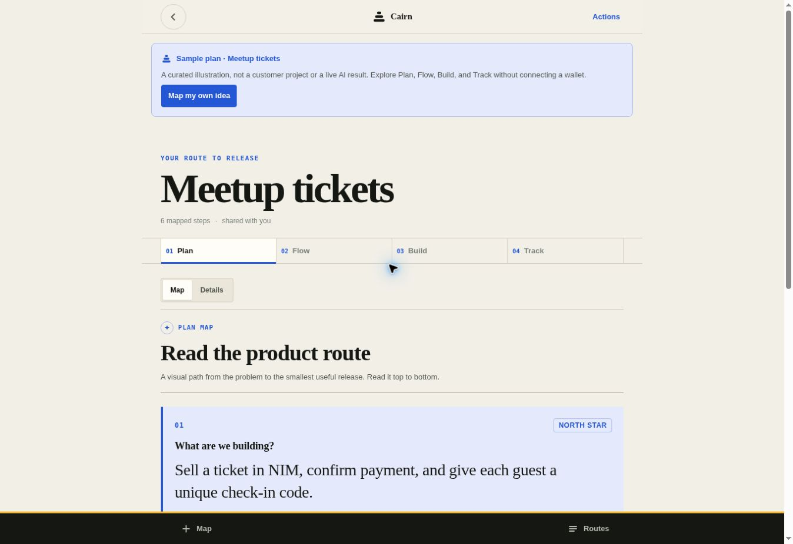
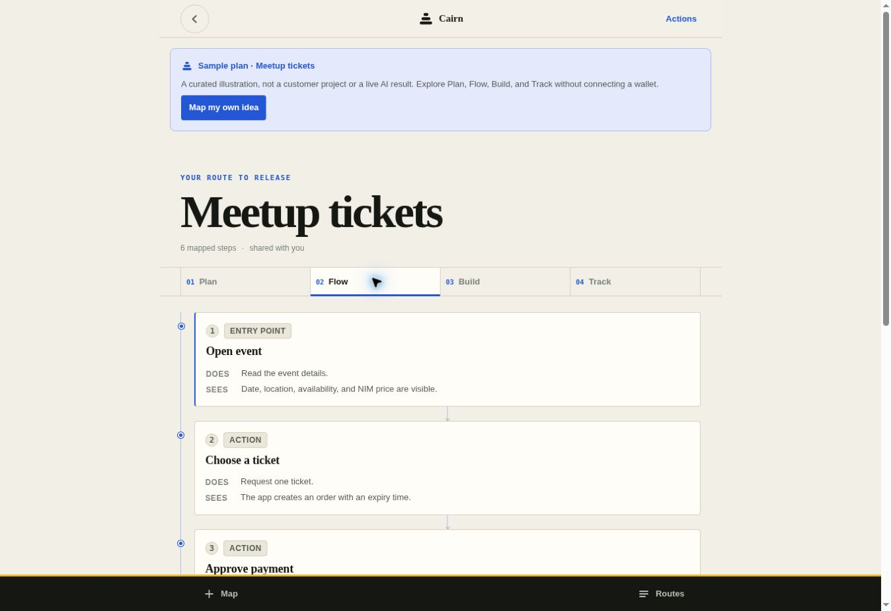

# Cairn

**Map the idea before you build it.**

[](https://github.com/Teecash96/cairn/actions/workflows/ci.yml)
[](LICENSE)

[Open Cairn](https://cairn.cairn-planner.workers.dev/) ·
[Competition](https://miniappscompetition.com/submissions/cycle2) ·
[Architecture](docs/architecture.md) ·
[Release checklist](docs/release-checklist.md)



Cairn is a Nimiq Pay mini app that turns a few sentences about a product idea into
a builder pack an indie builder can act on:

- a **product requirements document** — summary, problem, target user, core
  features, user stories, success criteria, and an explicit list of what it
  assumed and what it left out
- a **Visual PRD** — a one page canvas that shows the problem, user, promise,
  first release, proof, and guardrails in one scan
- a **user-flow diagram** — five to eight connected steps from first open to
  finished task, including one real decision point with both outcomes
- a **Build plan** — a small MVP scope, three milestones, risks, acceptance
  tests, and the next action
- a **Track workspace** — a local project board and timeline for milestones,
  task status, due dates, labels, priorities, notes, and simple blockers
- a **Reality check** — three prioritized concerns with the smallest test or fix

Every field is editable. Your plan is local by default. Cairn uses practical MVP
planning rather than Scrum process. Plans and planner refinements are free. An
optional protected team workspace lets the owner share only Track with named
Nimiq wallets.

A cairn is a stack of stones left to mark the route for whoever comes next. That
is what a PRD is for.

## Why Cairn instead of a general AI chat?

| General AI chat | Cairn |
| --- | --- |
| Produces a useful answer that becomes another document to manage | Produces one connected, editable product workspace |
| Requires the builder to invent the planning structure and prompts | Creates the PRD, visual map, user flow, MVP, milestones, risks, and tasks together |
| Ends when the response is complete | Continues into a board, timeline, next action, and targeted refinements |
| Shares a conversation or copied text | Shares a read-only plan or wallet-protected Track workspace with Viewer and Editor roles |
| Depends on an account and cloud history | Keeps the private plan local by default and uses a Nimiq wallet for identity, teams, and teammate rewards |

The difference is not only generation. Cairn turns a response into a product
system a builder and a named teammate can use after the prompt is over.

## Product tour

| Plan | Flow |
| --- | --- |
|  |  |
| **Build** | **Track** |
|  |  |

---

## Why it exists

The gap between "I have an idea" and "I can start building" is a blank page.
Filling it properly takes a product manager twenty minutes of structured
thinking, and most ideas never get those twenty minutes — so they either die or
get built without a plan.

Cairn brings that structured thinking to a phone with a signed Nimiq wallet
session and no payment wall.

## How it works

1. Describe the idea in your own words. One field is required.
2. Tap **Generate plan**. In Nimiq Pay, Cairn asks the injected wallet to connect
   and sign a short login challenge. In Chrome, Nimiq Hub opens the wallet for the
   same signature flow. This creates a short lived server session. The prompt
   happens on the action you already chose to take.
3. Gemini writes the full builder pack. It takes about twenty seconds.
4. Edit anything. It autosaves to your device.
5. Open **Plan** and choose **Map** for a one page view of the problem, user,
   promise, first release, proof, and guardrails.
6. Open **Track** to update task status, dates, labels, blockers, and private
   notes. Changes save on this device.
7. Open **Build** for the builder pack summary, or ask Cairn to sharpen one part
   of the plan.
8. Copy it out as Markdown, share a public read only link, or create a protected
   team workspace for Track.

### Planner follow ups

The Build tab has four quick actions: cut MVP scope, break work into smaller
tasks, find missing risks, and improve acceptance tests. You can also ask a
custom question. Cairn shows targeted changes in a preview before applying them.
Planner actions are free. Fair use rate limits and a daily service limit prevent
unbounded AI cost. Task status, dates, labels, notes, and blockers stay on your
device when a refinement keeps that task. Cairn sends only task text to Gemini.

### Track the work

The **Track** tab is a local owner workspace. Board view groups work into vertical
milestone lanes. Timeline view shows milestone ranges and task due dates. Use the
filters to see all, to do, in progress, done, or blocked work. A task becomes
blocked when one of its selected dependencies is not done. A milestone is blocked
only when you mark it blocked.

The first click on a task opens its editor. Status can also change directly from
the lane. Dates are never invented by AI. Notes, priorities, and dependency
details remain private to this device.

### Team workspaces

The owner can create one protected team workspace for a plan. The owner adds
Nimiq wallet addresses and chooses a **Viewer** or **Editor** role for each one.
Members must open the protected link with the wallet that was added. The link is
only a locator. The Worker checks the signed wallet session on every request.

Team members see and, when allowed, edit Track only. The shared snapshot contains
milestones, task text, status, labels, dates, and the owner's milestone blocker
flag. It does not contain the PRD, user flow, Build summary, private notes,
priorities, or dependency details. Owner changes to the team board sync through a
revision check, so a stale editor cannot overwrite a newer update. Public Share
links remain separate and read only.

After a member completes a task, the owner can send a NIM reward directly to
that member's wallet. Cairn checks the public transaction, records its proof on
the completed task, and never holds the funds. Slow confirmations keep polling
automatically; resuming confirmation reuses the receipt and does not request a
second payment. Owners can also delete a team workspace and revoke its link.

## Public pages

The deployed Worker serves a small information layer beside the mini app:

1. `/case-studies` contains illustrative examples. They are not customer
   claims.
2. `/faq` answers product, timing, free access, sharing, and privacy questions.
3. `/privacy` explains data handling in plain language.
4. `/thank-you` is a simple completion page for links and demos.
5. Unknown routes show a branded 404 page.

The app has a clear response promise: most plans are ready in under 30 seconds.
The public pages use canonical URLs, Open Graph metadata, a social card,
`robots.txt`, `sitemap.xml`, and `llms.txt`.

## Nimiq identity and rewards

Cairn does not charge for plans or planner refinements. A signed Nimiq wallet
session proves identity for AI requests and protected teams. Owners can send
NIM directly to a teammate after that person completes a task. Cairn never
holds those funds.

The Worker preserves the legacy SQLite-backed credit ledger for compatibility,
but Cairn no longer offers a donation checkout. It uses the configured Nimiq
RPC service to verify direct teammate rewards. See
[credit ledger cutover](docs/credit-ledger-cutover.md)
before changing bindings or migrations. The checked-in production configuration
has the reconciled ledger enabled; do not change its binding, class, or object
name after it has accepted production writes.

## What leaves your phone

Stated plainly, because it matters:

| Data | Where it goes |
| --- | --- |
| The idea you type | Google's Gemini API, via Cairn's server, to write the plan |
| The finished plan and private Track data | Your device's local storage. **Nothing else**, unless you use a planner follow up, public Share, or a protected team workspace |
| A plan you refine | Cairn's server and Google's Gemini API for that one follow up. The PRD, flow, and text only builder pack are sent so the change can be targeted. Private tracker metadata is not sent |
| A plan you tap **Share** on | Cairn's server, so the link can be opened until you revoke it. Progress, milestone dates, task due dates, labels, and recorded reward proofs are shared. Notes, priorities, and dependencies are not shared |
| A protected team workspace | Cairn's server, so named wallet members can use Track until the owner deletes it. Milestones, task text, status, labels, dates, milestone blocker flags, and recorded reward proofs are shared. The PRD, flow, Build summary, notes, priorities, and dependencies are not shared |
| Your wallet address | Cairn's server, as the identity bound to your short lived wallet session and protected team access |
| A teammate reward transaction hash | Cairn's server and the configured Nimiq RPC service, to verify the public reward transaction |
| A request network address | A short lived abuse counter in Cairn's server. It is not used for analytics |

There is no analytics, no tracking, and no third-party script. The app loads no
external fonts. The browser talks to Cairn's API and the wallet flow. Cairn's
Worker sends generation requests to Gemini and public payment lookups to the
configured Nimiq RPC service on the server side.

Plans are stored per device by design. Clearing the app's storage deletes them,
and there is no private copy on a server to restore from. Use **Save JSON backup**
and **Restore JSON backup** to move or recover a route. A restored file becomes
a new local route and never inherits control of old share or team links.

## Running it locally

```bash
npm install
npm run dev          # http://localhost:5173
```

To run the full local Worker, copy `.dev.vars.example` to `.dev.vars` and add a local Gemini
key. Then run `npm run build` and `npm run worker:dev`. The Worker uses its local KV store.
Never commit `.dev.vars`.

In a production build, Chrome uses Nimiq Hub for real wallet authentication.
Only a local Vite preview with no `VITE_API_BASE` uses a synthetic wallet
and an obviously-labelled placeholder plan. This keeps local UI work walkable
without weakening the production wallet path.

When you open the deployed app in Chrome, tap **Generate plan** and complete the
Nimiq Hub popup. Allow popups for the Cairn site. Hub returns the selected wallet
address and signature to Cairn, which the Worker verifies before the free AI
action. Teammate reward payments appear only inside an owner-managed team workspace.

### On a real device

The only form factor that matters is a portrait phone inside the Nimiq Pay
WebView.

```bash
npm run dev -- --host
```

Then in Nimiq Pay: **Mini Apps → open URL → `http://<your-lan-ip>:5173`**.

Note that LAN HTTP is not a secure context, so `navigator.clipboard` and
`crypto.randomUUID` are absent there. Both have fallbacks
(`src/lib/clipboard.ts`, `src/lib/plan.ts`) — which is the whole reason to test
this way rather than only on `localhost`.

### Build

```bash
npm run check        # types, tests, secret scan, dependency audit, production build
npm run build        # vue-tsc -b && vite build
npm test             # Node's built-in test runner
```

## Layout

```
src/
  lib/
    nimiq.ts       Nimiq Pay SDK wrapper. Provider methods RESOLVE with
                   `T | ErrorResponse` rather than throwing, so every call goes
                   through unwrap().
    session.ts     Which mode are we in, and whose wallet is this
    plan.ts        The data model, migration, and on-device library
    tracker.ts     Progress, dates, blocker, and dependency calculations
    api.ts         Typed client for the server
    markdown.ts    Plan → Markdown / plain text
    clipboard.ts   Copy, with a non-secure-context fallback
    stub.ts        Offline placeholder generator, dev only
  components/
    NewPlan.vue      Screen one: the description
    Workspace.vue    One route: Plan, Flow, Build, and Track
    PrdView.vue      The PRD, readable and editable
    VisualPrd.vue    A visual, editable PRD canvas
    FlowDiagram.vue  The flow diagram
    BuildView.vue    Read only builder pack summary
    MilestoneTracker.vue  Owner board and timeline tracker
    TrackerEditorSheet.vue  Task and milestone editor
    TeamPanel.vue    Owner member and permission controls
    RefineSheet.vue  Preview and apply targeted planner follow ups
    Library.vue      Everything you have made
  tests/
    client/          Migration, tracker calculations, and targeted merge tests
    worker/          Auth, budget, shape, share, and team permission tests
```

## Stack

Vue 3 + TypeScript + Vite on the front, with one Cloudflare Worker serving the
app and API. KV stores sessions, explicit shares, team workspaces, rate limits,
and budget counters. A SQLite-backed Durable Object owns atomic credits and
payment receipt redemption. No component library, CSS framework, webfont, or
analytics is used. Type checking is strict, including `erasableSyntaxOnly` and
`verbatimModuleSyntax`.

Google Analytics is intentionally not included. Cairn is a privacy first mini
app, and adding third party tracking would contradict the disclosure shown
before generation. Local business schema, maps, and directions are also not
included because Cairn has no physical business location.

No API key, secret, or credential is committed to this repository. The Gemini
key lives only in an encrypted Cloudflare secret binding.

## Licence

MIT — see [LICENSE](LICENSE).

Built for the [Nimiq Mini Apps Competition](https://miniappscompetition.com).
