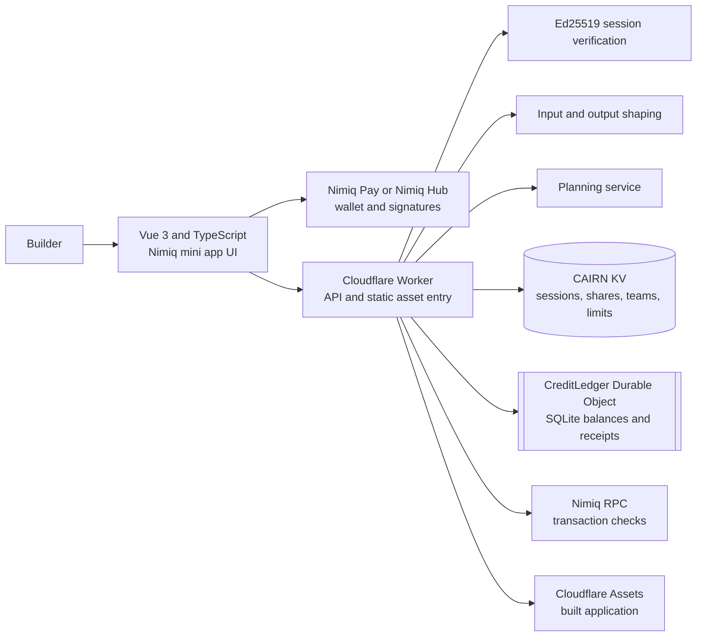

# Cairn

**Map the idea before you build it.**

Cairn is a Nimiq mini app for turning a product idea into a practical builder
pack. It connects the product brief, user flow, MVP scope, ordered tasks,
acceptance tests, and progress tracker so a builder can move from an idea to a
first release without rewriting the plan.

Planning and planner refinements are free. Nimiq wallet authentication protects
AI requests and team workspaces. NIM is used only when a user chooses an
explicit product action such as anchoring a PRD or paying a milestone bounty.

## The problem

An idea is easy to describe and hard to build. A useful first release needs a
clear user, a real problem, a small scope, a complete first flow, and tests that
show when the work is done. These decisions are often spread across notes and
documents. The builder then has to reconcile conflicting versions before work
can start.

Cairn keeps those decisions together and makes a plan change visible. If the
requirement changes, Cairn shows the affected flow, requirements, tasks, and
acceptance tests before the builder applies the update.

## What Cairn produces

* Product requirements document with the problem, target user, goal, features,
  stories, success criteria, assumptions, and out of scope items.
* Visual PRD that summarizes the problem, promise, first release, proof, and
  guardrails.
* User flow with five to eight connected steps and one explicit decision point.
* MVP build plan with scope, three milestones, ordered tasks, risks, acceptance
  tests, and a next action.
* Local Track workspace with task status, dates, labels, priorities, notes,
  dependencies, blockers, and progress.
* Private builder standup log saved on the current device.
* Reality check with three prioritized concerns and the smallest useful test or
  fix.

Every field is editable. The plan is local by default.

## Product flow

1. Describe the idea. Only the idea field is required.
2. Authenticate with a Nimiq wallet when you generate or refine a plan.
3. Review the generated product map and builder pack.
4. Edit the plan. Changes autosave to the device.
5. Use **Change the plan, update the build** to submit a new requirement.
6. Review affected outputs. Accept or reject the proposed changes.
7. Use Track to execute tasks, record blockers, and follow the next useful move.
8. Export Markdown or copy a GitHub issue draft. Share a read only snapshot or
   create a protected Track workspace for named Nimiq wallets.

The refinement flow preserves stable task IDs and local progress. Completed work
is not silently replaced. Private tracker metadata stays on the device unless
the owner explicitly shares the allowed Track projection.

## Architecture



The detailed component map and request flows are in
[docs/architecture.md](docs/architecture.md). Runtime contracts and the route
table are in [docs/technical.md](docs/technical.md). The threat model and
operational controls are in [docs/safety-model.md](docs/safety-model.md).

## Setup

Prerequisites: Node.js 20 or newer and npm.

```bash
npm ci
npm run dev
```

The Vite app runs at `http://localhost:5173`. For a local Worker, copy
`.dev.vars.example` to `.dev.vars`, add the local provider secret, then run:

```bash
npm run build
npm run worker:dev
```

Never commit `.dev.vars`. Production secrets belong in encrypted Cloudflare
bindings. The repository does not contain a provider key or a wallet key.

## Technical documentation

* [Architecture](docs/architecture.md): components, boundaries, and request
  flows.
* [Technical reference](docs/technical.md): data model, API routes, storage,
  local development, tests, and deployment configuration.
* [Safety model](docs/safety-model.md): trust boundaries, controls, failure
  handling, privacy, and release checks.
* [Nimiq payment actions](docs/product/nim-payment.md): free planning, wallet
  identity, anchors, bounties, and legacy receipt compatibility.
* [Credit ledger cutover](docs/credit-ledger-cutover.md): the only procedure
  for changing the production ledger.
* [Security policy](SECURITY.md): reporting and repository controls.

## Safety model in one page

* Planning requires a short lived wallet session, not a payment.
* The Worker verifies a one time Ed25519 signature challenge and binds the
  session to the signed wallet address.
* User input and planning output are bounded and shaped before storage or use.
* Free planning is protected by per wallet and IP rate limits plus a daily
  service budget.
* Private plans and detailed tracker metadata remain in browser storage unless
  the user shares them.
* Public shares expose an allowlisted read only projection.
* Team links are locators, not credentials. Every team request needs a wallet
  session and a matching member role.
* Current credit balances and receipt consumption use one SQLite Durable Object
  transaction. Legacy KV records remain a read only replay guard.
* Production never enables `DEV_TRUST_PAYMENTS`.

See the [full safety model](docs/safety-model.md) for assumptions and limits.

## Nimiq integration

Cairn uses Nimiq for wallet identity and explicit builder actions. Nimiq Pay
handles the native mini app flow. A normal browser uses Nimiq Hub. The wallet
signs the authentication challenge and approves any optional NIM transfer.

The current explicit actions are:

1. PRD anchor: write a Blake2b hash of the current PRD into a one Luna self
   transfer, then verify the confirmed transaction.
2. Milestone bounty: send NIM directly from the owner wallet to a collaborator
   after the owner marks the milestone complete.
3. Builder tip: an optional transfer on a shared plan. Cairn never holds these
   funds or decides a dispute.

None of these actions is required to generate or refine a plan.

## Data and privacy

The finished plan, private notes, dates, priorities, and dependency details are
stored in the browser's local storage. A generation sends the idea and optional
context to Cairn's server and planning service. A refinement sends only the
plan fields needed for that change. An explicit public share or team workspace
sends only its documented Track projection.

Cairn does not receive a private key, password, payment card, uploaded file, or
wallet seed phrase. It does not use analytics, third party scripts, or external
fonts. Clearing browser storage removes private local plans. Cairn does not claim
encrypted cloud backup.

## Commands

```bash
npm test                 # unit and Worker tests
npm run typecheck        # client and Worker type checks
npm run build            # production client build
npm run security:deps    # production dependency audit
npm run security:secrets # credential-shaped value scan
npm run worker:deploy    # build and deploy the Worker
```

Run the first five checks before a deployment. Do not use a real payment for
automated testing. A wallet owner must approve any real NIM transfer.

## Repository layout

```text
src/
  App.vue                 App state and orchestration
  components/             Plan, Build, Flow, Track, team, and payment UI
  lib/                    Plan model, tracker, API, wallet, and exports
tests/                    Client and Worker regression tests
worker/
  index.ts                Worker routes and static asset fallback
  auth.ts                 Wallet challenge and session verification
  generate.ts             Planning service adapter and schema
  shape.ts                Request and response validation
  credit-ledger.ts        SQLite Durable Object balance owner
  payments.ts             Nimiq transaction inspection
  team.ts and share.ts    Protected Track and public share records
docs/                     Architecture, technical, safety, and cutover guides
public/                   Static public pages and metadata
wrangler.toml             Worker bindings and non secret deployment settings
```

## Current limits

Cairn produces a structured draft, not a guarantee that a product will succeed.
The reality check is not legal, financial, security, or market advice. Dates are
not invented by the planning service. Local plans have no private server backup.
Payment verification depends on the Nimiq network and RPC availability. Free
planning can be rate limited or paused when the daily service budget is reached.

## License

See [LICENSE](LICENSE).
