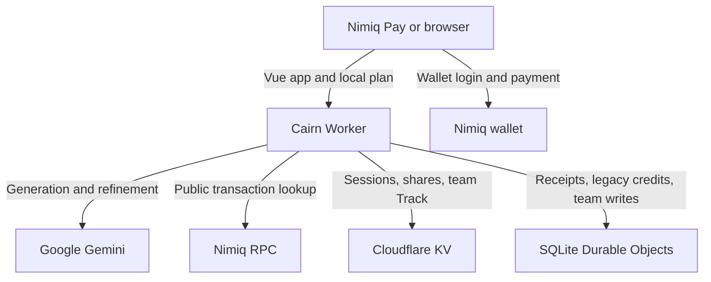

# Cairn architecture

The browser keeps the private working plan. The Worker provides signed-wallet
sessions, free rate-limited AI actions, explicit sharing, optional NIM support,
and protected team Track data.

## Trust boundaries

- The wallet signs login challenges and payments. Cairn never receives a private key.
- The browser stores the full private plan and private Track metadata in local storage.
- Gemini receives idea or plan text only for the AI action the user requests.
- The Nimiq RPC receives a public transaction lookup during payment verification.
- Public shares and protected team workspaces are explicit server-side snapshots.
- Team members receive Track fields only. They do not receive the PRD, flow, Build
  summary, private notes, priorities, or dependency details.

## Payment state

For optional support, the client retains an opaque pending receipt in session
storage and polls with bounded backoff. The Worker verifies one network
confirmation, then accepts the transaction hash once. The Durable Object keeps
receipt replay protection and legacy credit recovery atomic. Generation and
refinement remain free and do not depend on payment.

See [Required NIM payment](product/nim-payment.md) and
[Credit ledger cutover](credit-ledger-cutover.md) for the operational contract.
