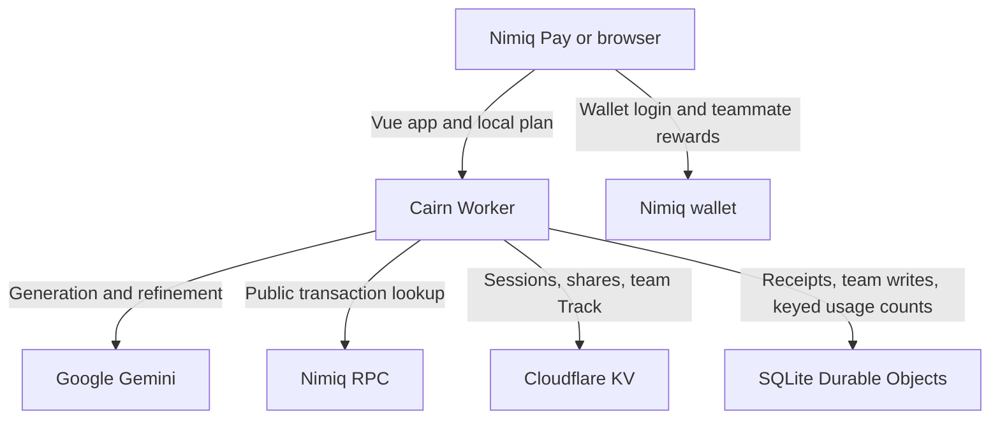

# Cairn architecture

The browser keeps the private working plan. The Worker provides signed-wallet
sessions, free rate-limited AI actions, explicit sharing, direct teammate
rewards, and protected team Track data.

## Trust boundaries

- The wallet signs login challenges and payments. Cairn never receives a private key.
- The browser stores the full private plan, check-ins, build journal, validation
  experiments, release draft, and private Track metadata in local storage.
- Gemini receives idea or plan text only for the AI action the user requests. An
  explicit progress replan also sends a compact check-in summary, task status,
  task due dates, and milestone blocker state. It does not send the full journal
  or private tracker metadata.
- The Nimiq RPC receives a public transaction lookup during payment verification.
- Public shares and protected team workspaces are explicit server-side snapshots.
- Team members receive Track fields only. They do not receive the PRD, flow, Build
  summary, private notes, priorities, or dependency details.
- The usage ledger hashes signed wallet addresses with a private HMAC key inside
  the Durable Object. It stores no raw wallet address, plan content, task text,
  IP address, balance, or browser fingerprint. Its public endpoint returns
  aggregate counts only.

## Usage evidence

`UsageLedger` is one globally named SQLite Durable Object. That single writer
keeps distinct-wallet and action counts exact under concurrency. Its HMAC key is
generated and retained inside Durable Object storage; it is not a repository or
deployment secret. Successful Worker handlers record semantic events after the
underlying action completes. The public `GET /api/usage` endpoint exposes only
the aggregate contract rendered at `/usage`.

See [Usage evidence](product/usage-evidence.md) for metric definitions and the
privacy model.

## Reward and legacy payment state

For teammate rewards, the client retains an opaque pending receipt in local
storage and polls with bounded backoff. The Worker verifies one network
confirmation before attaching the proof to a completed task. The old credit
ledger remains for compatibility, but there is no donation interface.

See [Legacy NIM ledger](product/nim-payment.md) and
[Credit ledger cutover](credit-ledger-cutover.md) for the operational contract.
