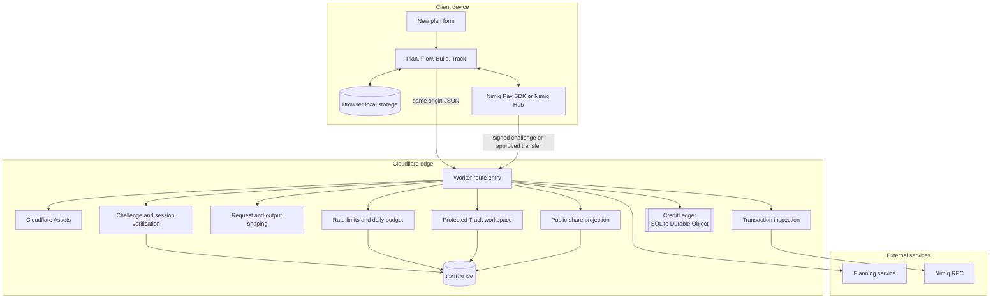
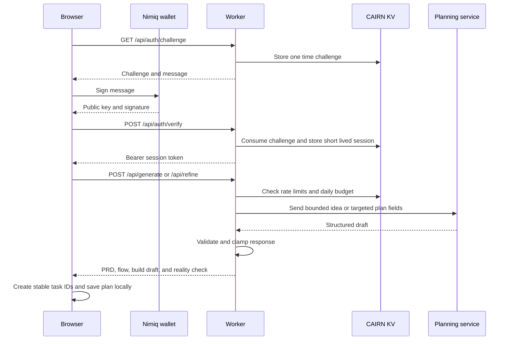

# Cairn architecture

This document describes the deployed shape of Cairn. It is a single web
application with a same origin API. The browser owns private plan state. The
Worker owns authentication, validation, sharing, team access, provider calls,
and payment verification.

## Component map

## Responsibilities

| Component | Responsibility | Does not do |
| --- | --- | --- |
| Vue client | Forms, editing, local plan library, task identity, progress, exports, and user confirmation | Store private keys, decide payment validity, or mark AI work complete |
| Nimiq Pay and Hub | Select a wallet, sign a challenge, and approve an NIM transfer | Give Cairn a seed phrase or private key |
| Worker | Same origin API, authentication, validation, provider request, share and team access, and transaction verification | Trust a client supplied wallet identity or client supplied credit balance |
| Planning service | Return the structured PRD, flow, build draft, and reality check | Receive private tracker metadata or decide local task progress |
| CAIRN KV | Sessions, challenges, shares, teams, rate limits, budget counters, and legacy payment markers | Own the current credit balance after ledger cutover |
| CreditLedger Durable Object | Atomic balance reads, spends, receipt redemption, and duplicate protection | Verify that a blockchain transfer is real |
| Nimiq RPC | Provide network transaction data used by the Worker verifier | Grant Cairn authority over a wallet |
| Cloudflare Assets | Serve the built static application and public pages | Route API requests before the Worker |

## Trust boundaries

1. The client is untrusted. A user can edit every request in the browser.
2. The wallet is the authority for a signature and an approved transfer. Cairn
   never receives wallet secrets.
3. The Worker is the policy boundary. It derives the session address from a
   verified public key and rejects mismatched body addresses.
4. The planning service is an untrusted output source. The Worker bounds and
   validates the response before sending it to the client.
5. KV and the Durable Object are trusted storage services. The Worker controls
   which records can be read or changed.
6. Nimiq RPC is an external dependency. A missing, delayed, or malformed answer
   must fail closed for payment verification.

## Free planning request

Planning is free. The wallet session proves identity and supplies abuse limit
keys. It does not spend a credit and it does not grant the Worker permission to
move funds.

## Plan and refinement lifecycle

The planning service returns a server authored draft without task IDs, dates,
status, notes, priorities, dependencies, or builder log entries. The client
normalizes the draft and creates stable task IDs. It owns local progress.

The change flow is deliberately two stage:

1. The client sends a bounded copy of the current plan and a requirement change.
2. The Worker validates the request and asks for targeted changes.
3. The client maps the response to stable task IDs where text is unchanged.
4. The client renders affected requirements, flow steps, milestones, tasks, and
   acceptance tests.
5. The owner accepts or rejects the proposal.
6. An accepted proposal updates the builder pack and Track board together.

No completed task is silently marked incomplete. Dates, priorities, notes,
dependencies, and builder log entries do not come from the planning service.

## Public shares and protected teams

Public sharing writes an allowlisted `PublicPlan` projection to a `share:<id>`
KV record. It excludes private notes, priorities, dependency details, and
builder logs. The public route is read only. A fork copies the public content
into a new local plan with fresh progress.

A team workspace writes only a Track projection to `team:<id>`. The owner adds a
full Nimiq address, a role title, and either `viewer` or `editor`. The invite URL
only identifies the team. Each request still requires a valid wallet session.
The Worker checks the session address against the owner or member record. Team
updates include a revision number, so a stale editor receives a conflict rather
than overwriting a newer board.

## Payment and ledger path

NIM transfers are explicit product actions. Planning does not depend on a
payment. For an anchor, bounty, or tip, the wallet approves a transfer and the
client stores the receipt needed for later verification.

Legacy credit receipt recovery follows this sequence:

1. The Worker authenticates the wallet.
2. `payments.ts` inspects the supplied receipt through the configured Nimiq RPC.
3. The verifier requires the correct sender, recipient, amount, and network
   confirmation. Wrong wallet and not yet visible states are separate errors.
4. The Worker sends the verified transaction hash to the named
   `CreditLedger` object.
5. The object performs the balance update and receipt marker in one SQLite
   transaction.

The object name is `cairn-credits-v1`. The migration tag is
`v1-credit-ledger`. After cutover, KV `credit:*` values are imported on first
access only and old `spent:*` values remain a read only replay guard. The
cutover procedure is in [docs/credit-ledger-cutover.md](credit-ledger-cutover.md).

## Deployment topology

`wrangler.toml` defines one Worker named `cairn`, one `ASSETS` binding, the
existing `CAIRN` KV namespace, and the `CREDIT_LEDGER` Durable Object binding.
The application and API share an origin, which avoids a production API base URL
and limits cross origin exposure.

The encrypted provider key is configured outside Git. Non secret variables hold
the payment recipient, price, plan count, RPC URL, daily budget, app URL, model
selection, and the ledger readiness gate. `DEV_TRUST_PAYMENTS` must remain off in
production.

## Failure direction

Cairn fails closed when authentication, validation, rate limits, provider output,
RPC inspection, or the credit ledger is unavailable. A generation failure does
not consume a paid credit. A retry of a newly redeemed receipt returns the
current balance without granting it again. The old KV writing Worker must not be
restored after the Durable Object has accepted writes.
